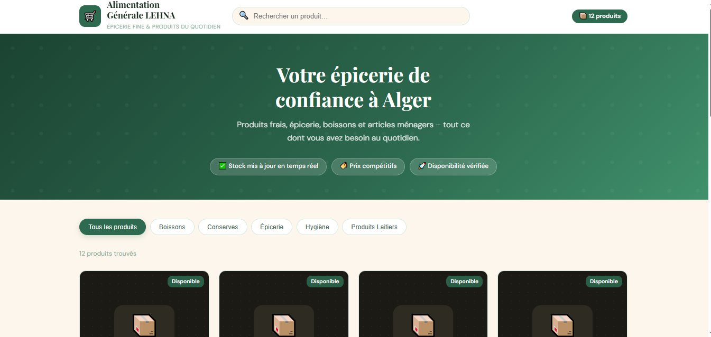
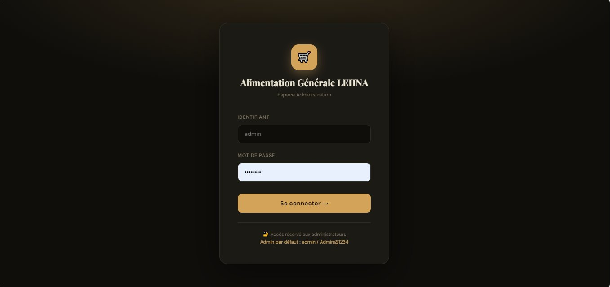
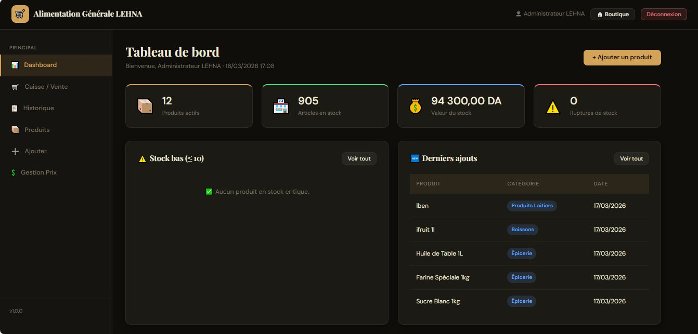
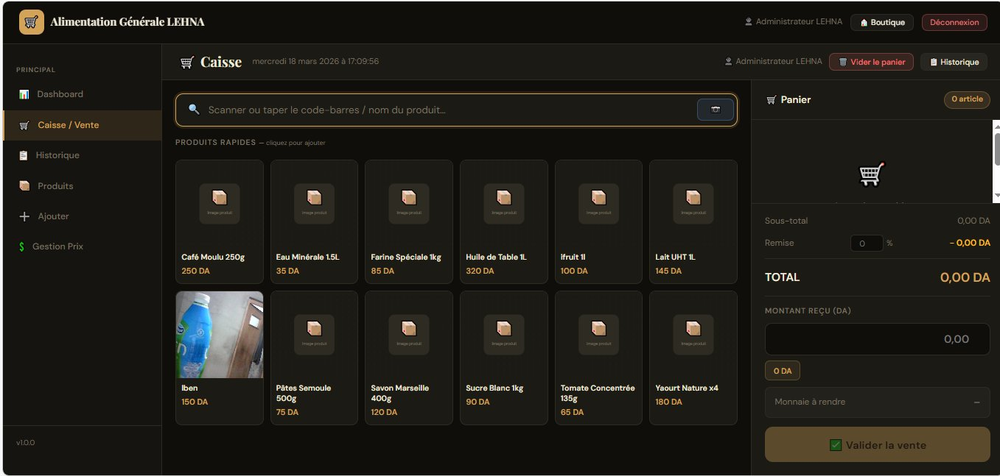
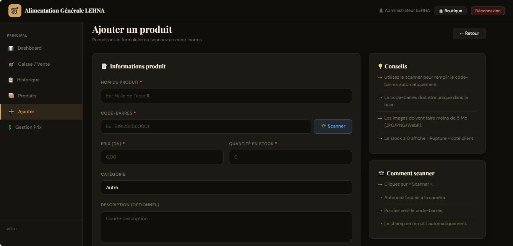

# 🛒 Alimentation Générale LEHNA

> Application web de gestion d'épicerie avec boutique publique, caisse/POS et espace administration — développée en PHP/MySQL.


---

## 📸 Aperçu

### 🏪 Boutique publique


### 🔐 Espace Administration — Connexion


### 📊 Tableau de bord


### 🧾 Caisse / Point de vente


### ➕ Ajout de produit


---

## 🎯 Fonctionnalités

### Interface Admin
| Fonctionnalité | Description |
|---|---|
| 🔐 Authentification | Login sécurisé avec session PHP + CSRF |
| 📊 Dashboard | Stats stock, ruptures, valeur totale |
| 📦 Gestion produits | Ajouter / Modifier / Supprimer |
| 🧾 Caisse / POS | Vente rapide avec scanner et remise |
| 📷 Scanner code-barres | Détection via caméra (WebRTC + QuaggaJS) |
| 💲 Gestion des prix | Mise à jour rapide avec sauvegarde AJAX |
| 📁 Upload image | Upload sécurisé avec vérification MIME |
| 📋 Historique des ventes | Consultation et export des transactions |

### Boutique Publique
| Fonctionnalité | Description |
|---|---|
| 🏪 Catalogue | Affichage grille responsive |
| 🔍 Recherche live | Filtrage dynamique sans rechargement |
| 📁 Filtres catégorie | Boissons, Conserves, Épicerie, Hygiène, Produits Laitiers |
| 🏷️ Badge stock | Disponible / Stock bas / Rupture |
| 📱 Design responsive | Mobile, tablette, desktop |

---

## 🏗️ Structure du projet

```
lehna/
├── .htaccess
├── index.php                  ← Boutique publique
├── database.sql               ← Script SQL complet
├── ventes_tables.sql          ← Tables des ventes
├── reset_password.php
├── admin/
│   ├── index.php              ← Dashboard
│   ├── login.php
│   ├── logout.php
│   ├── products.php
│   ├── product_add.php
│   ├── product_edit.php
│   ├── prices.php
│   ├── vente.php              ← Caisse / POS
│   ├── ventes_history.php
│   ├── ajax/
│   │   ├── pos_search.php
│   │   ├── process_sale.php
│   │   ├── delete_product.php
│   │   ├── update_price.php
│   │   └── search_barcode.php
│   └── partials/
│       ├── navbar.php
│       └── sidebar.php
├── includes/
│   ├── config.php             ← Configuration BDD & app
│   ├── db.php                 ← Connexion PDO
│   ├── functions.php          ← Fonctions utilitaires
│   └── auth.php               ← Middleware authentification
└── assets/
    ├── css/
    │   ├── style.css
    │   ├── admin.css
    │   └── pos.css
    └── images/
        └── uploads/           ← Images produits (doit être writable)
```

---

## 📋 Prérequis

| Logiciel | Version minimum | Rôle |
|---|---|---|
| XAMPP | 8.0+ | Serveur local (Apache + MySQL + PHP) |
| PHP | 8.1+ | Langage backend |
| MySQL | 5.7+ ou 8.0+ | Base de données |
| Navigateur | Chrome / Firefox / Edge récent | Scanner caméra (WebRTC) |

---

## 🚀 Installation

### 1. Installer XAMPP
Téléchargez depuis https://www.apachefriends.org et installez dans `C:\xampp`.

### 2. Copier les fichiers
```
C:\xampp\htdocs\lehna\
```

### 3. Démarrer XAMPP
Ouvrez le **XAMPP Control Panel** → démarrez **Apache** et **MySQL**.

### 4. Créer la base de données
1. Ouvrez http://localhost/phpmyadmin
2. Cliquez **Importer** → sélectionnez `database.sql`
3. Cliquez **Exécuter**

Importez aussi `ventes_tables.sql` de la même façon.

### 5. Configurer la connexion
Éditez `includes/config.php` :
```php
define('DB_HOST',   'localhost');
define('DB_NAME',   'lehna_db');
define('DB_USER',   'root');
define('DB_PASS',   '');
define('APP_URL',   'http://localhost/lehna');
```

### 6. Permissions
```bash
# Linux/Mac uniquement
chmod 775 /path/to/lehna/assets/images/uploads/
```

### 7. Accéder au site

| Page | URL |
|---|---|
| Boutique publique | http://localhost/lehna |
| Administration | http://localhost/lehna/admin/ |

---

## 🔐 Connexion administrateur

| Champ | Valeur |
|---|---|
| Identifiant | `admin` |
| Mot de passe | `Admin@1234` |

> ⚠️ **Changez ce mot de passe en production !**

---

## 🔒 Sécurité

- ✅ PDO avec requêtes préparées (anti-injection SQL)
- ✅ Token CSRF sur tous les formulaires et requêtes AJAX
- ✅ Validation MIME des images uploadées
- ✅ Hachage bcrypt des mots de passe
- ✅ Sessions sécurisées avec expiration automatique
- ✅ Headers HTTP de sécurité (X-Frame-Options, etc.)
- ✅ Soft-delete (produits désactivés, pas supprimés)
- ✅ Dossier uploads protégé contre l'exécution de scripts

---

## 🛠️ Dépannage

| Erreur | Solution |
|---|---|
| Erreur de connexion BDD | Vérifiez que MySQL est démarré + `config.php` |
| Caméra ne s'ouvre pas | Utilisez `localhost` ou HTTPS, autorisez la caméra |
| Upload d'image échoue | Vérifiez permissions `uploads/` et `upload_max_filesize` dans `php.ini` |
| Page blanche / 500 | Activez `DEBUG_MODE = true` dans `config.php` |

---

## 🚀 Déploiement en production

1. `DEBUG_MODE = false` dans `config.php`
2. Changez les identifiants admin
3. Configurez un mot de passe MySQL fort
4. Activez HTTPS
5. Changez `secure => true` dans `session_set_cookie_params()`

---

*Projet Alimentation Générale LEHNA — v1.0.0*